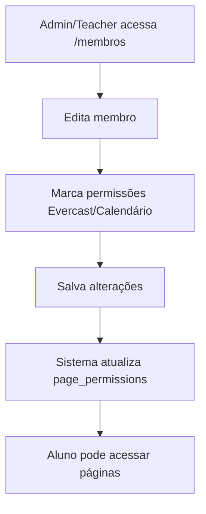

# 👥 Guia: Página de Membros - Gestão de Permissões

## 🎯 **Resumo**

A página de **Membros** (`/membros`) já está implementada e é a interface perfeita para gerenciar permissões dos alunos para acessar **Evercast** e **Calendário**.

## 🔍 **Status da Implementação**

### ✅ **Já Implementado**
- **Interface completa** de gestão de membros
- **Sistema de permissões** por página (Quiz, Flashcards, Evercast, Calendário)
- **Criação e edição** de membros com permissões
- **Filtros e busca** de membros
- **Gestão de turmas** e planos de acesso
- **Senhas provisórias** para novos membros

### ❌ **Faltando**
- **Tabela `page_permissions`** no Supabase (precisa ser criada)

## 🛠️ **Solução Completa**

### **Passo 1: Criar a Tabela de Permissões**

**Acesse o Supabase Dashboard:**
1. Vá para [supabase.com](https://supabase.com)
2. Acesse seu projeto
3. Vá em **SQL Editor**
4. Execute o seguinte SQL:

```sql
-- Criar tabela de permissões de acesso por página
CREATE TABLE IF NOT EXISTS page_permissions (
  id UUID DEFAULT gen_random_uuid() PRIMARY KEY,
  user_id UUID REFERENCES auth.users(id) ON DELETE CASCADE,
  page_name VARCHAR(100) NOT NULL, -- 'quiz', 'flashcards', 'evercast', 'calendario'
  has_access BOOLEAN DEFAULT false,
  granted_by UUID REFERENCES auth.users(id),
  granted_at TIMESTAMP WITH TIME ZONE DEFAULT NOW(),
  expires_at TIMESTAMP WITH TIME ZONE,
  UNIQUE(user_id, page_name)
);

-- Criar índices para performance
CREATE INDEX IF NOT EXISTS idx_page_permissions_user ON page_permissions(user_id);
CREATE INDEX IF NOT EXISTS idx_page_permissions_page ON page_permissions(page_name);

-- Habilitar RLS (Row Level Security)
ALTER TABLE page_permissions ENABLE ROW LEVEL SECURITY;

-- Políticas de segurança
CREATE POLICY "Users can read own permissions" ON page_permissions
  FOR SELECT USING (auth.uid() = user_id);

CREATE POLICY "Teachers and admins can manage permissions" ON page_permissions
  FOR ALL USING (
    EXISTS (
      SELECT 1 FROM user_profiles
      WHERE user_id = auth.uid()
      AND role IN ('teacher', 'admin')
    )
  );
```

### **Passo 2: Usar a Página de Membros**

**Acesse `/membros` como admin ou teacher:**

#### **2.1. Dar Permissões a Alunos Existentes**
1. **Clique no botão "Editar"** (ícone de lápis) de um aluno
2. **Na seção "Permissões de Acesso"**, marque as caixas:
   - ✅ **Evercast** - Para acesso aos áudios e vídeos
   - ✅ **Calendário** - Para acesso aos eventos
3. **Clique em "Salvar Alterações"**

#### **2.2. Criar Novo Membro com Permissões**
1. **Clique em "Novo Membro"**
2. **Preencha os dados**:
   - Nome completo
   - E-mail
   - Turma (opcional)
   - Plano de acesso
   - Datas de início e expiração
3. **Na seção "Permissões de Acesso"**, marque:
   - ✅ **Evercast**
   - ✅ **Calendário**
4. **Clique em "Criar Membro"**
5. **Anote a senha provisória** que será gerada

### **Passo 3: Dar Permissões em Massa (Script)**

**Após criar a tabela, execute:**
```bash
node grant-student-access-evercast-calendario.js
```

Este script irá:
- ✅ Buscar todos os alunos existentes
- ✅ Conceder acesso ao **Evercast** para todos
- ✅ Conceder acesso ao **Calendário** para todos
- ✅ Verificar se as permissões foram aplicadas

## 🎨 **Interface da Página de Membros**

### **Funcionalidades Principais**

| Funcionalidade | Descrição |
|----------------|-----------|
| **👥 Lista de Membros** | Visualizar todos os alunos com filtros |
| **➕ Novo Membro** | Criar aluno com permissões específicas |
| **✏️ Editar Membro** | Modificar dados e permissões |
| **🔑 Senha Provisória** | Gerar senha temporária para login |
| **🗑️ Deletar Membro** | Remover aluno do sistema |
| **🔍 Busca e Filtros** | Encontrar membros por nome, email ou turma |

### **Permissões Disponíveis**

| Página | Descrição | Controle |
|--------|-----------|----------|
| **Quiz** | Página de questionários | ✅ Checkbox |
| **Flashcards** | Página de cartões de estudo | ✅ Checkbox |
| **Evercast** | Página de áudios e vídeos | ✅ Checkbox |
| **Calendário** | Página de eventos | ✅ Checkbox |

### **Status dos Membros**

| Status | Descrição |
|--------|-----------|
| **🟢 Ativo** | Acesso válido e não expirado |
| **🔴 Expirado** | Acesso expirado ou inativo |
| **🔑 Trocar Senha** | Precisa alterar senha no próximo login |

## 🔧 **Como Funciona o Sistema**

### **Fluxo de Permissões**



### **Verificação de Acesso**

1. **Aluno tenta acessar** `/evercast` ou `/calendario`
2. **PagePermissionGuard verifica**:
   - É admin/teacher? → ✅ Acesso liberado
   - É student? → Verifica `page_permissions`
3. **Se tem permissão** → ✅ Acesso liberado
4. **Se não tem permissão** → ❌ Acesso negado

## 📊 **Verificar Permissões**

### **Via Interface**
- Acesse `/membros`
- Clique em "Editar" em qualquer aluno
- Veja as permissões marcadas na seção "Permissões de Acesso"

### **Via SQL (Supabase)**
```sql
-- Ver permissões de um usuário específico
SELECT 
  up.display_name,
  up.role,
  pp.page_name,
  pp.has_access,
  pp.granted_at
FROM user_profiles up
LEFT JOIN page_permissions pp ON up.user_id = pp.user_id
WHERE up.user_id = 'ID_DO_USUARIO';

-- Ver todas as permissões
SELECT 
  up.display_name,
  pp.page_name,
  pp.has_access
FROM user_profiles up
LEFT JOIN page_permissions pp ON up.user_id = pp.user_id
WHERE pp.page_name IN ('evercast', 'calendario')
ORDER BY up.display_name;
```

## 🚨 **Solução Rápida (Alternativa)**

Se quiser dar acesso imediato sem usar a página de membros:

**Modifique o `PagePermissionGuard`:**
```typescript
// Em components/page-permission-guard.tsx, linha 33-37
if (profile.role === 'teacher' || profile.role === 'admin' || profile.role === 'student') {
  setHasAccess(true)
  setIsLoading(false)
  return
}
```

⚠️ **Atenção**: Esta solução remove o controle granular de permissões.

## 🎯 **Resultado Final**

Após seguir este guia:

1. ✅ **Tabela `page_permissions` criada**
2. ✅ **Página de membros funcionando**
3. ✅ **Interface para gerenciar permissões**
4. ✅ **Alunos com acesso ao Evercast e Calendário**
5. ✅ **Controle granular de permissões**

## 🔄 **Manutenção Futura**

### **Para Novos Alunos**
1. Acesse `/membros`
2. Clique em "Novo Membro"
3. Marque as permissões desejadas
4. Salve

### **Para Alterar Permissões**
1. Acesse `/membros`
2. Clique em "Editar" no aluno
3. Modifique as permissões
4. Salve

### **Para Remover Acesso**
1. Acesse `/membros`
2. Clique em "Editar" no aluno
3. Desmarque as permissões
4. Salve

## 📝 **Arquivos Relacionados**

- **`app/(authenticated)/membros/page.tsx`** - Interface principal
- **`app/server-actions.ts`** - Funções de backend
- **`components/page-permission-guard.tsx`** - Controle de acesso
- **`grant-student-access-evercast-calendario.js`** - Script de permissões em massa

A página de membros é a solução completa e profissional para gerenciar permissões! 🎉
