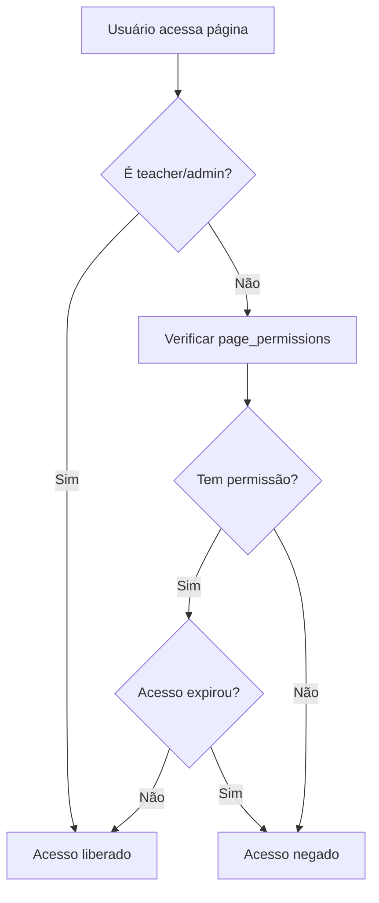

# 🔐 Guia: Como Dar Acesso aos Alunos para Evercast e Calendário

## 📋 Resumo do Problema

Os alunos não conseguem acessar as páginas **Evercast** e **Calendário** porque o sistema usa um controle de permissões baseado na tabela `page_permissions` que ainda não foi criada.

## 🛠️ Solução Passo a Passo

### 1. Criar a Tabela de Permissões

**Acesse o Supabase Dashboard:**
1. Vá para [supabase.com](https://supabase.com)
2. Acesse seu projeto
3. Vá em **SQL Editor**
4. Execute o seguinte SQL:

```sql
-- Criar tabela de permissões de acesso por página
CREATE TABLE IF NOT EXISTS page_permissions (
  id UUID DEFAULT gen_random_uuid() PRIMARY KEY,
  user_id UUID REFERENCES auth.users(id) ON DELETE CASCADE,
  page_name VARCHAR(100) NOT NULL, -- 'quiz', 'flashcards', 'evercast', 'calendario'
  has_access BOOLEAN DEFAULT false,
  granted_by UUID REFERENCES auth.users(id),
  granted_at TIMESTAMP WITH TIME ZONE DEFAULT NOW(),
  expires_at TIMESTAMP WITH TIME ZONE,
  UNIQUE(user_id, page_name)
);

-- Criar índices para performance
CREATE INDEX IF NOT EXISTS idx_page_permissions_user ON page_permissions(user_id);
CREATE INDEX IF NOT EXISTS idx_page_permissions_page ON page_permissions(page_name);

-- Habilitar RLS (Row Level Security)
ALTER TABLE page_permissions ENABLE ROW LEVEL SECURITY;

-- Políticas de segurança
CREATE POLICY "Users can read own permissions" ON page_permissions
  FOR SELECT USING (auth.uid() = user_id);

CREATE POLICY "Teachers and admins can manage permissions" ON page_permissions
  FOR ALL USING (
    EXISTS (
      SELECT 1 FROM user_profiles
      WHERE user_id = auth.uid()
      AND role IN ('teacher', 'admin')
    )
  );
```

### 2. Conceder Acesso aos Alunos

**Após criar a tabela, execute o script:**

```bash
node grant-student-access-evercast-calendario.js
```

Este script irá:
- ✅ Buscar todos os alunos na tabela `user_profiles`
- ✅ Conceder acesso permanente ao **Evercast** para todos os alunos
- ✅ Conceder acesso permanente ao **Calendário** para todos os alunos
- ✅ Verificar se as permissões foram concedidas corretamente

### 3. Verificar se Funcionou

**Teste com um aluno:**
1. Faça login como aluno
2. Tente acessar `/evercast` - deve funcionar
3. Tente acessar `/calendario` - deve funcionar

## 🔍 Como o Sistema Funciona

### Estrutura de Permissões



### Páginas Controladas

- ✅ **Dashboard** - Todos têm acesso
- ✅ **Quiz** - Todos têm acesso  
- ✅ **Flashcards** - Todos têm acesso
- ✅ **Ranking** - Todos têm acesso
- 🔒 **Evercast** - Precisa de permissão específica
- 🔒 **Calendário** - Precisa de permissão específica
- 🔒 **Suporte** - Todos têm acesso
- 🔒 **Settings** - Todos têm acesso

### Roles e Permissões

| Role | Evercast | Calendário | Outras Páginas |
|------|----------|------------|----------------|
| **Admin** | ✅ Automático | ✅ Automático | ✅ Todas |
| **Teacher** | ✅ Automático | ✅ Automático | ✅ Todas |
| **Student** | 🔒 Precisa permissão | 🔒 Precisa permissão | ✅ Básicas |

## 🚨 Solução Alternativa (Temporária)

Se você quiser dar acesso imediato sem criar a tabela, pode modificar o `PagePermissionGuard`:

**Arquivo:** `components/page-permission-guard.tsx`

**Linha 33-37:** Modificar para:
```typescript
// Professores, admins E estudantes têm acesso total
if (profile.role === 'teacher' || profile.role === 'admin' || profile.role === 'student') {
  setHasAccess(true)
  setIsLoading(false)
  return
}
```

⚠️ **Atenção:** Esta solução remove o controle granular de permissões.

## 📊 Verificar Permissões

**Para verificar as permissões de um usuário específico:**

```sql
SELECT 
  up.display_name,
  up.role,
  pp.page_name,
  pp.has_access,
  pp.granted_at,
  pp.expires_at
FROM user_profiles up
LEFT JOIN page_permissions pp ON up.user_id = pp.user_id
WHERE up.user_id = 'ID_DO_USUARIO_AQUI';
```

**Para ver todas as permissões:**

```sql
SELECT 
  up.display_name,
  up.role,
  pp.page_name,
  pp.has_access
FROM user_profiles up
LEFT JOIN page_permissions pp ON up.user_id = pp.user_id
ORDER BY up.display_name, pp.page_name;
```

## 🎯 Resultado Final

Após seguir este guia:

1. ✅ **Tabela `page_permissions` criada**
2. ✅ **Todos os alunos têm acesso ao Evercast**
3. ✅ **Todos os alunos têm acesso ao Calendário**
4. ✅ **Sistema de permissões funcionando**
5. ✅ **Controle granular mantido para futuras páginas**

## 🔧 Manutenção Futura

**Para dar acesso a uma nova página:**
1. Adicione a página no `PagePermissionGuard`
2. Execute o script de concessão de acesso
3. Ou use a interface de administração (se implementada)

**Para remover acesso:**
```sql
UPDATE page_permissions 
SET has_access = false 
WHERE page_name = 'nome_da_pagina' AND user_id = 'id_do_usuario';
```

**Para dar acesso temporário:**
```sql
INSERT INTO page_permissions (user_id, page_name, has_access, expires_at)
VALUES ('id_do_usuario', 'nome_da_pagina', true, '2024-12-31 23:59:59');
```
